# G.M-AND-SONS
Handloom , powerloom cloths commission agent and order suppliers
<!DOCTYPE html>
<html lang="en">
<head>
    <meta charset="UTF-8">
    <meta name="viewport" content="width=device-width, initial-scale=1.0">
    <title>G.M. & SONS | Luxury Indian Textiles</title>
    
</head>
<body>

    <nav>
        
G.M. & SONS

        <ul>
            <li><a href="#collection">Collection</a></li>
            <li><a href="#">Heritage</a></li>
            <li><a href="#">8090307576</a></li>
        </ul>
    </nav>

    <main>
        <section class="hero">
            <h1>Timeless Artistry</h1>
            
Hand-woven masterpieces crafted for the modern era. Experience the legacy of G.M. & SONS.

            <button class="cta-button">View Collection</button>
        </section>

        <section id="collection" class="products">
            <h2 class="section-title">items</h2>
            

                <article class="card">
                    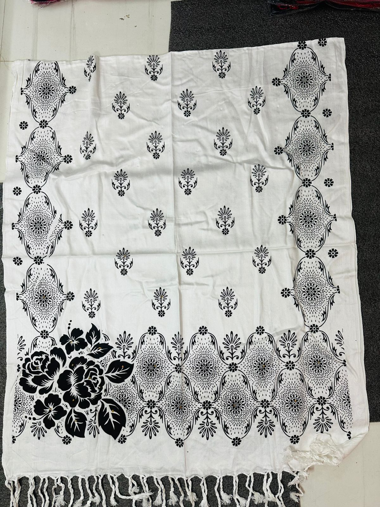
                     
                      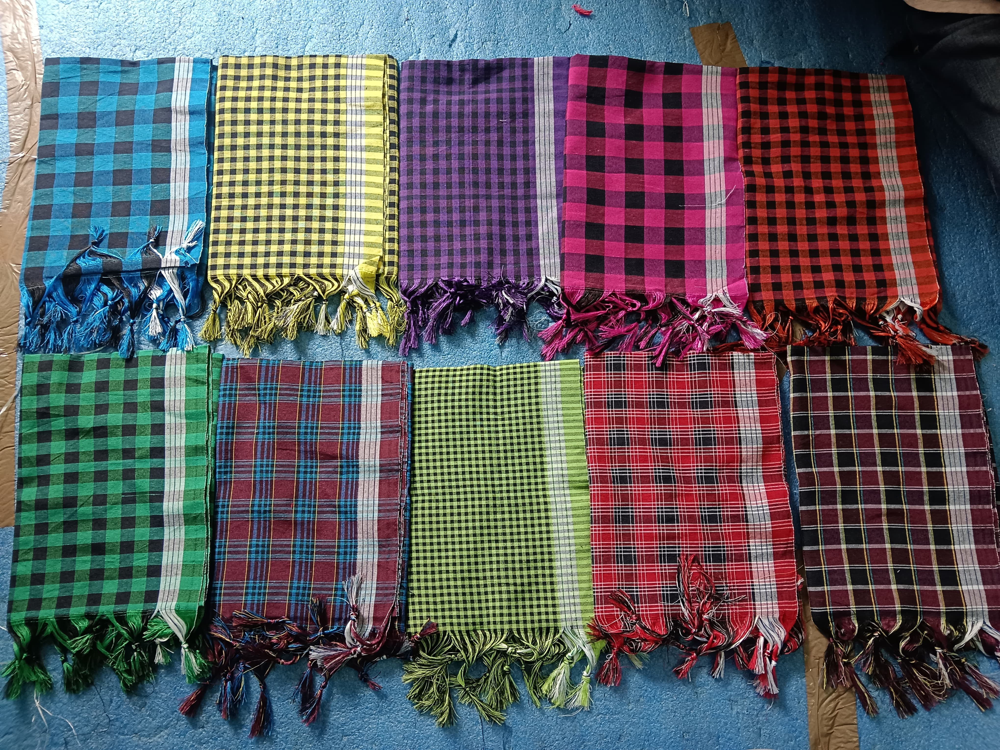
                       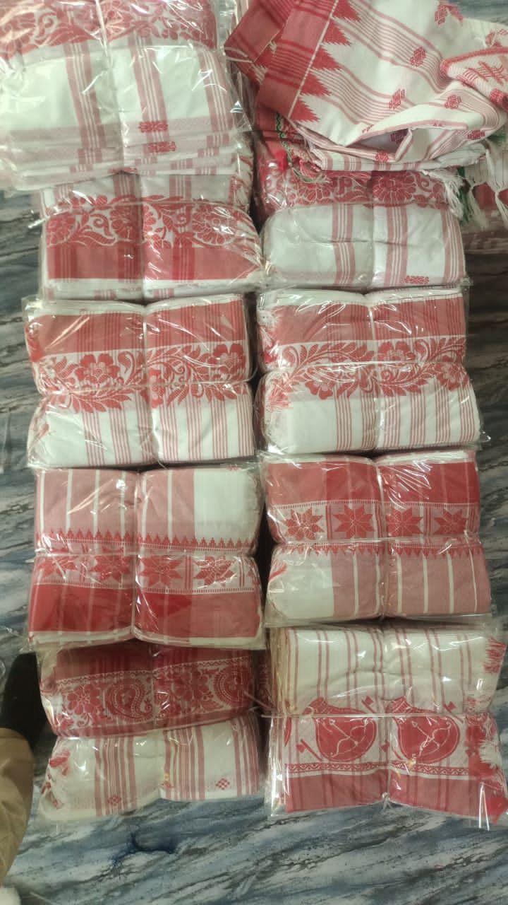
                        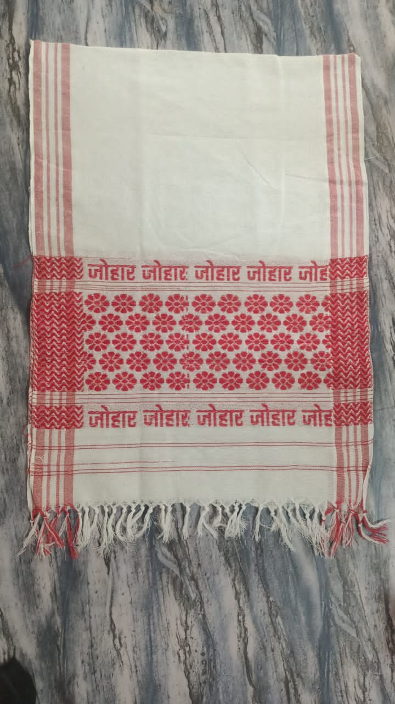
                         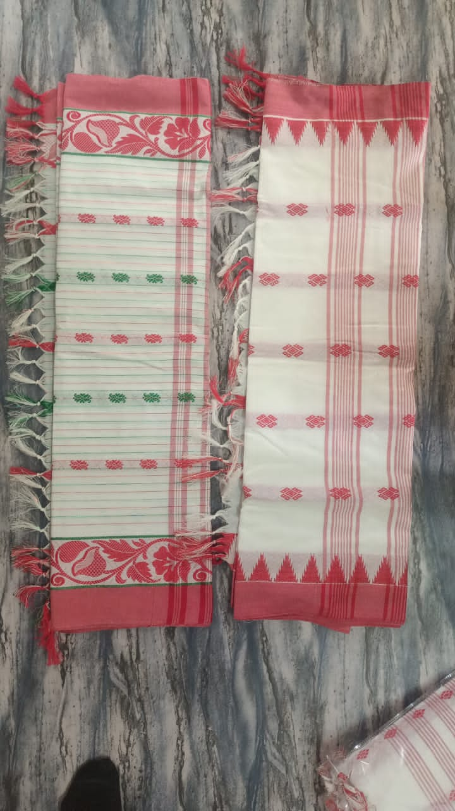
                          
                           
                           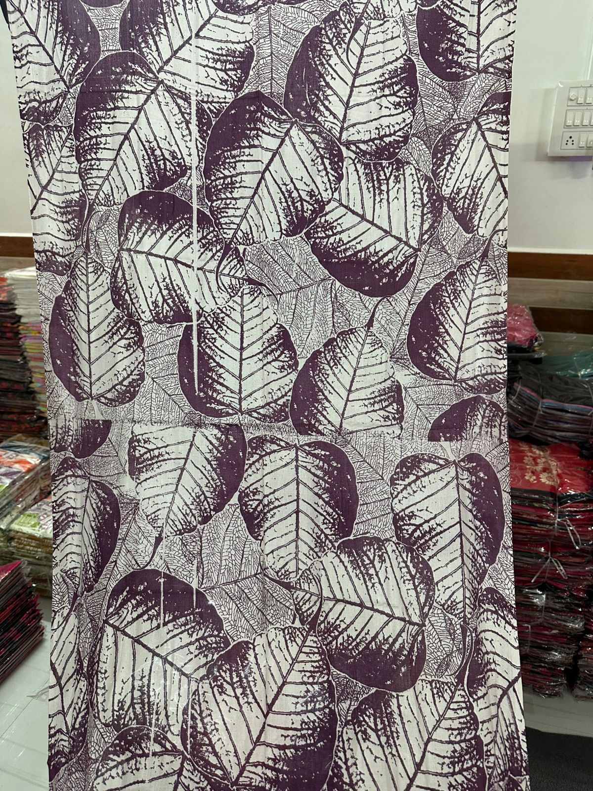
                           
                           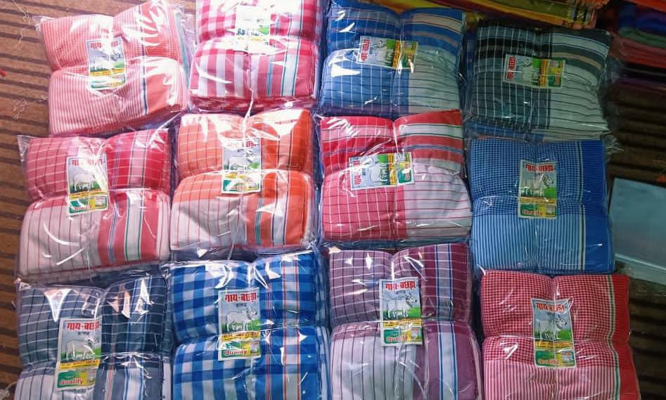
                           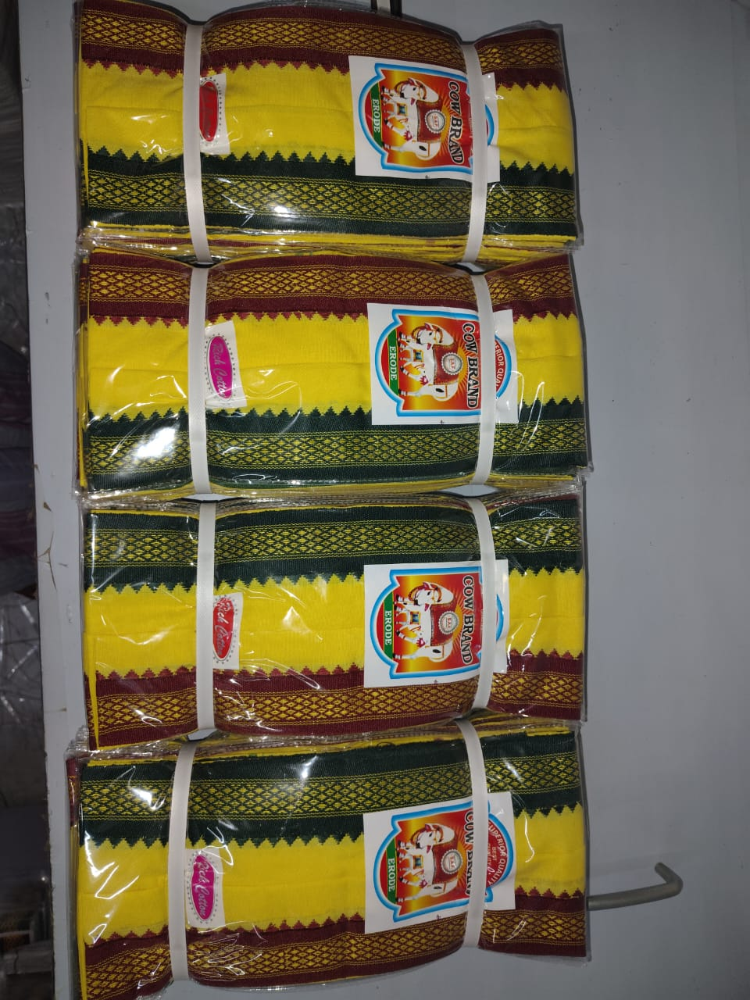
                           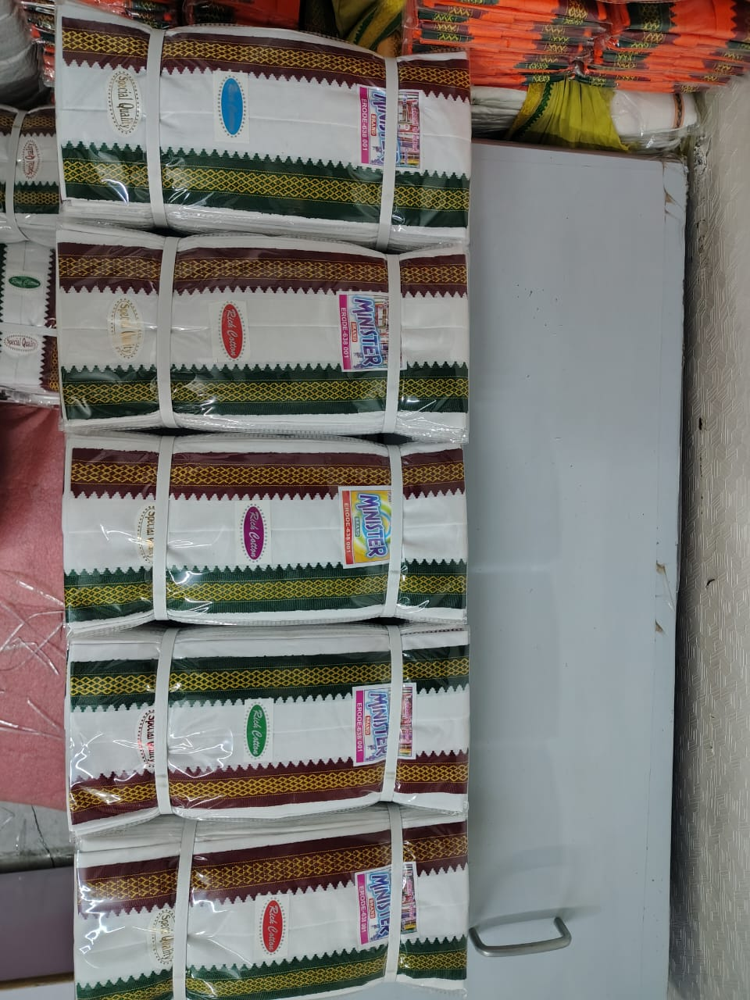
                           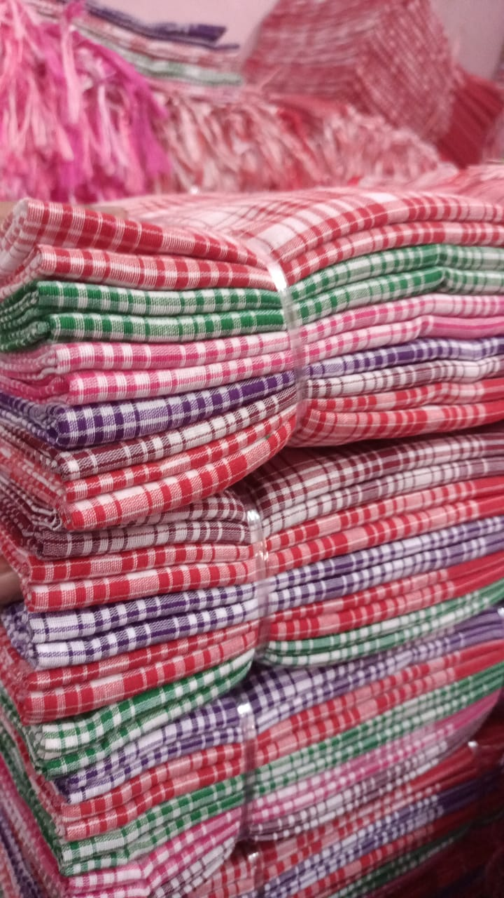
                           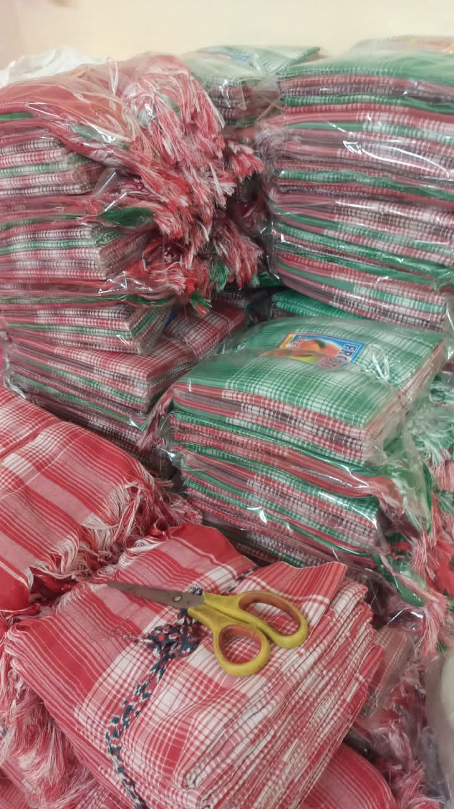
                           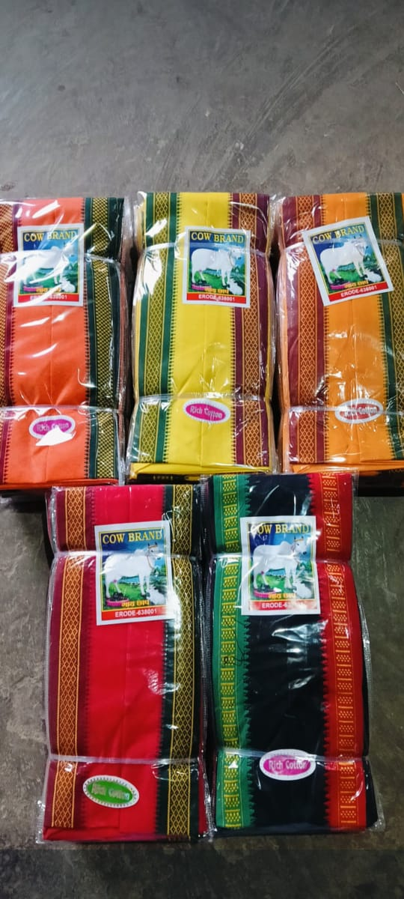
                           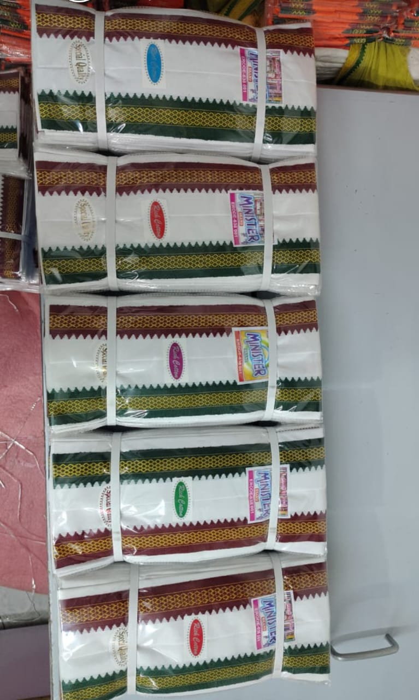
                           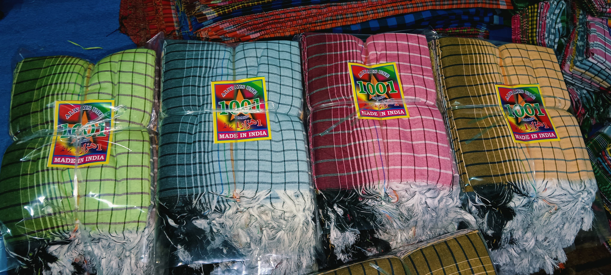
                           
                   
                </article>
            

        </section>
    </main>

    <footer>
        
&copy; 2026 G.M. & SONS TEXTILES. All Rights Reserved.

    </footer>

</body>
</html>
